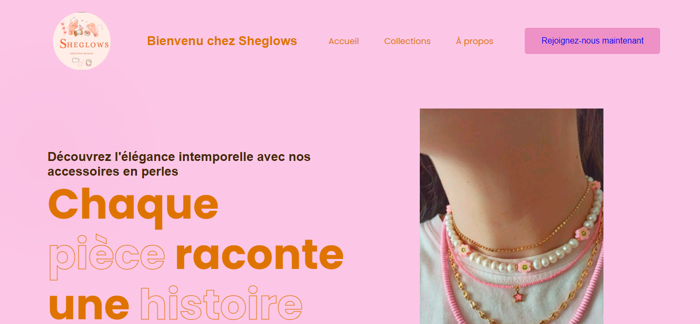
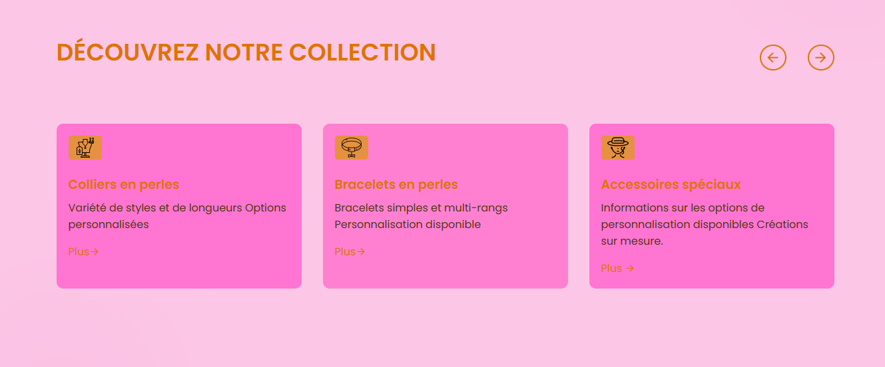

Sheglows Site 

------------->Caractéristiques du site

Présentation du projet : 
  Une page principale décrivant le concept entrepreneurial, ses objectifs, et son impact potentiel.
Design minimaliste et professionnel : 
  Un design épuré mettant en avant le contenu grâce à l'utilisation stratégique de HTML et CSS.
Navigation simple :
  Structure intuitive avec une barre de navigation permettant d'explorer différentes sections du site.

  ## Captures d'écran

### Page d'accueil
## Captures d'écran

(screenshots/3.PNG)

